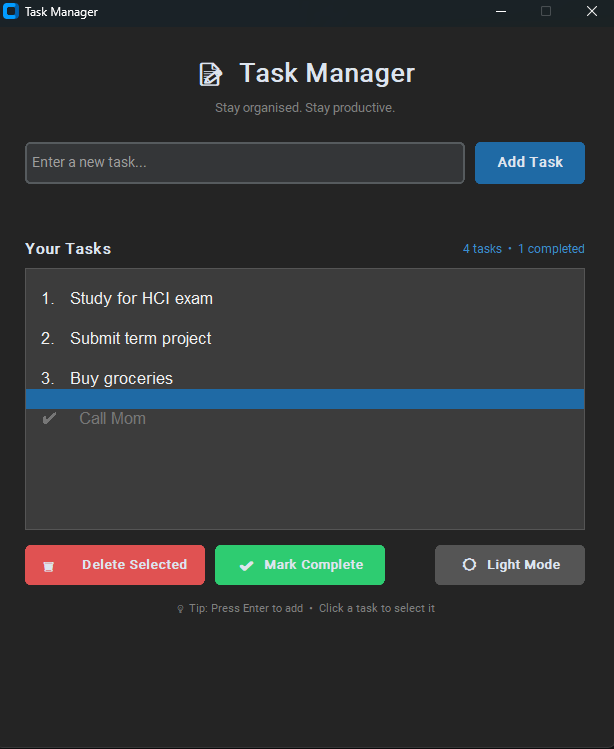

# HCI Task Manager (Python + CustomTkinter)

## Overview

This HCI Task Manager is a desktop application built with Python and CustomTkinter. It focuses on usability, speed, and clean interaction design. You can manage tasks through a simple interface built around core Human-Computer Interaction (HCI) principles.

---

## Features

* Add, edit, and delete tasks
* Mark tasks as completed or pending
* Task deadlines and reminders
* Drag-and-drop task ordering
* Dark/light mode toggle
* Clean UI using CustomTkinter
* Persistent storage
* Input validation and real-time feedback

---

## Tech Stack

* **Language:** Python 3.x
* **GUI Framework:** CustomTkinter
* **Storage:** JSON / SQLite

---

## Installation

### 1. Clone the repository

```bash
git clone https://github.com/aimlin9/hci-task-manager.git
cd hci-task-manager
```

### 2. Install dependencies

```bash
pip install customtkinter
```

(Optional)

```bash
pip install -r requirements.txt
```

### 3. Run the application

```bash
python main.py
```

---

## Project Structure

```bash
hci-task-manager/
│
├── main.py   # Contains UI, logic, and data handling
└── README.md
```

---

## Usage

* Launch the app
* Enter a task and press **Enter** or click **Add Task**
* Click a task to select it
* Use available buttons to:

  * Mark complete
  * Delete
  * Reorder tasks (drag-and-drop)

---

## HCI Design Principles Applied

* **Consistency:** Same layout and controls across the app
* **Feedback:** Immediate updates after actions
* **Simplicity:** Clean interface with minimal elements
* **Visibility:** Task list and status always visible
* **Error Prevention:** Input validation before adding tasks

---

## Screenshot



---

## Future Improvements

* Search and filter tasks
* Categories or tags
* More keyboard shortcuts
* Export/import tasks

---

## Contributing

1. Fork the repository
2. Create a branch
3. Make changes
4. Submit a pull request

---

## License

MIT License

---

## Author

GitHub: https://github.com/aimlin9
